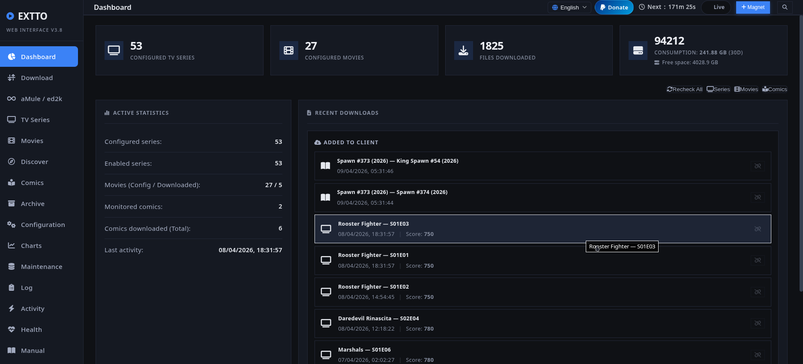

<div align="center">
  
  <h1>EXTTO — The All-in-One Media Automation System</h1>
  <p><em>Tired of running 5 different heavy apps to manage your media? EXTTO does it all in one lightweight Python daemon.</em></p>
  
  [](EUPL-1.2%20EN.txt)
  [](https://www.python.org/)
  [](https://www.paypal.com/cgi-bin/webscr?cmd=_donations&business=azanzani@gmail.com&item_name=Support+EXTTO+Project)
</div>

> **English** | [Italiano](#italiano)

---

**EXTTO** is a self-hosted media automation system for Linux. It monitors RSS feeds, searches indexers, automatically downloads TV episodes, movies, and comic books, archives them perfectly, and notifies you via Telegram. All controlled by a sleek, responsive Web UI.

## ✨ Why EXTTO? (The Killer Features)

- 🧠 **One App to Rule Them All**: Replaces the need for Sonarr, Radarr, Prowlarr, Mylar, and a separate Torrent Client. 
- 🚀 **RAM Disk Downloads**: Protect your SSD from wear and tear! EXTTO can download small torrents directly to a RAM Disk (`tmpfs`) and move them to your NAS only when 100% completed.
- 🫏 **eMule / eD2k Resurrection**: Still looking for rare, older files? EXTTO seamlessly integrates with `amuled` to fallback to the eD2k network when torrents fail.
- 📚 **Comic Books natively supported**: Automatically monitors and downloads weekly packs and single issues directly from GetComics (using Mega.nz or torrents).
- 🔒 **Privacy First**: Built-in VPN Killswitch (bind to `tun0`/`wg0`) and automatic **IP Blocklist updating**.

## 🛠️ Core Features

- **Multi-client support**: Embedded libtorrent or external qBittorrent, Transmission, aria2 client
- **Smart Quality Scoring**: Automatically upgrades your existing media files when a better version (4K, HDR, Dolby Vision, better audio) is found.
- **TMDB & Trakt.tv Integration**: Fetches official metadata, syncs your watchlist, and scrobbles your watched episodes via OAuth2 Device Flow.
- **Smart Renaming**: Configurable formats with deep technical tags extraction via `pymediainfo`.
- **Telegram & Email Alerts**: Real-time notifications for downloads, system health, and storage space warnings.
- **Multilingual UI**: Beautiful, flat-design Web Interface available in English, Italian, German, French, and Spanish.

## 📦 Installation

```bash
git clone [https://github.com/buzzqw/extto.git](https://github.com/buzzqw/extto.git)
cd extto
chmod +x setup.sh start.sh
./setup.sh
```

**Options:**
```bash
./setup.sh --upgrade         # force upgrade of Python packages
```

## 🚀 Usage

```bash
sudo systemctl enable extto.service
sudo systemctl start extto.service

or

./start.sh              # Start engine + Web UI (default port 5000)
./start.sh --tui        # Start with full-screen Terminal UI (TUI)
```

The Web Interface will be available at `http://localhost:5000`.

---

<a name="italiano"></a>

<div align="center">
  <h1>EXTTO — Sistema di Automazione Media Definitivo</h1>
  <p><em>Stanco di tenere accesi 5 programmi pesanti per gestire i tuoi media? EXTTO fa tutto in un singolo e leggerissimo servizio Python.</em></p>
</div>

---

**EXTTO** è un sistema di automazione media self-hosted per Linux. Monitora i feed RSS, cerca sugli indexer, scarica automaticamente episodi TV, film e fumetti, li archivia in modo perfetto e ti avvisa su Telegram. Tutto controllato da una Web UI moderna e reattiva.

## ✨ Perché scegliere EXTTO?

- 🧠 **Tutto in Uno**: Sostituisce la necessità di avere Sonarr, Radarr, Prowlarr, Mylar e un Client Torrent separato.
- 🚀 **Download in RAM Disk**: Proteggi il tuo SSD dall'usura! EXTTO può scaricare i torrent più piccoli direttamente in un RAM Disk (`tmpfs`) e spostarli sul NAS solo quando sono completati al 100%.
- 🫏 **La Rinascita di eMule / eD2k**: Cerchi file vecchi o rari? EXTTO si integra perfettamente con `amuled` per usare la rete eD2k come scialuppa di salvataggio quando i torrent falliscono.
- 📚 **Supporto Nativo Fumetti**: Monitora e scarica automaticamente i weekly pack e i numeri singoli direttamente GetComics tramite Mega.nz o torrent.
- 🔒 **Privacy First**: VPN Killswitch integrato (vincola il traffico a `tun0`/`wg0`) e aggiornamento automatico delle **IP Blocklist**.

## 🛠️ Funzionalità Principali

- **Client multipli**: libtorrent integrato, qBittorrent, Transmission, aria2.
- **Scoring Qualità Intelligente**: Sostituisce automaticamente i tuoi file quando viene trovata una versione migliore (4K, HDR, Dolby Vision, audio superiore).
- **Integrazione TMDB & Trakt.tv**: Scarica metadati ufficiali, sincronizza la tua watchlist e segna gli episodi come visti tramite OAuth2 Device Flow.
- **Rinomina Avanzata**: Formati configurabili con estrazione di tag tecnici profondi tramite `pymediainfo`.
- **Notifiche Telegram & Email**: Avvisi in tempo reale per download, salute del sistema e spazio su disco in esaurimento.
- **Interfaccia Multilingua**: Web UI bellissima, in stile flat-design, disponibile in Italiano, Inglese, Tedesco, Francese e Spagnolo.

## 📦 Installazione

```bash
git clone [https://github.com/buzzqw/extto.git](https://github.com/buzzqw/extto.git)
cd extto
chmod +x setup.sh start.sh
./setup.sh
```

**Opzioni:**
```bash
./setup.sh --upgrade         # forza l'aggiornamento dei pacchetti Python
```

## 🚀 Avvio

in fase di setup potrete installare il servizio systemd di extto

```bash

sudo systemctl enable extto.service
sudo systemctl start extto.service

oppure

./start.sh              # avvia motore + Web UI (porta predefinita 5000)
./start.sh --tui        # avvia con l'interfaccia da Terminale a schermo intero
```

L'interfaccia Web sarà disponibile su `http://localhost:5000`.

## ❤️ Supporta il Progetto

EXTTO è un software libero sviluppato nel tempo libero. Se ti è utile, considera di supportarne lo sviluppo con una donazione:

[](https://www.paypal.com/cgi-bin/webscr?cmd=_donations&business=azanzani@gmail.com&item_name=Support+EXTTO+Project)
